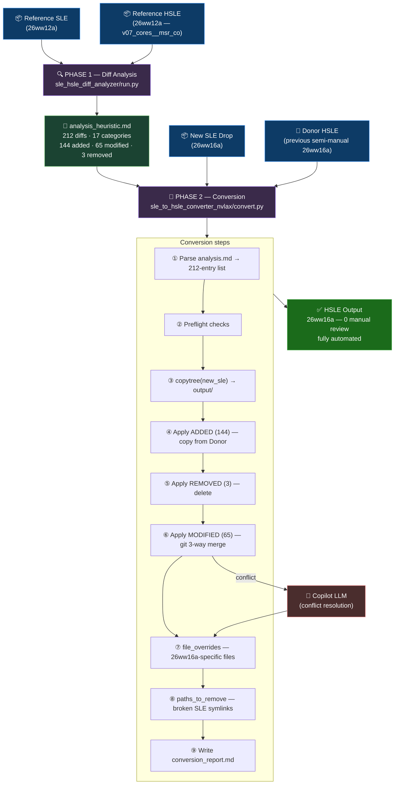
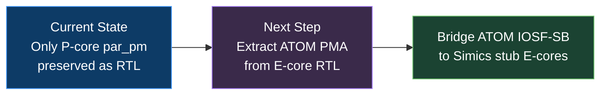

<div align="center">

# 🔀  HSLE RTL CORE PM

**Reverse-engineered architecture of the Nova Lake AX Hybrid SLE model with RTL Power-Management validation.**

[](https://github.com/pgesyuk/ai__sle_hybridization)
[]()
[]()
[]()

</div>

> **Sources used for this document:**  
> • Source-tree reverse-engineering (`Y:\hybridization\`, `Y:\nvl_ax\hsle\`)  
> • Presentation *"RTL CORE PMA"* (Ishaq, Mohd)  
> • OneNote: *HSLE RTL-core-pm / RTL CORE_PM: Intro* (Gesyuk, Pavel — 7 Sep 2025)

---

## 📑 Table of Contents

1. [📖 Terminology](#1--terminology)
2. [🤔 Why HSLE? The Core PM Problem](#2--why-hsle-the-core-pm-problem)
3. [⚖️ Three CORE PMA Solutions](#3-%EF%B8%8F-three-core-pma-solutions)
4. [💡 Chosen Approach: RTL CORE PM](#4--chosen-approach-rtl-core-pm)
5. [🏗️ Architecture: SLE vs HSLE](#5-%EF%B8%8F-architecture-sle-vs-hsle)
6. [🔧 Compile-Time Changes](#6--compile-time-changes)
7. [🔬 RTL Debug Hierarchy](#7--rtl-debug-hierarchy)
8. [🧪 Testbench Design](#8--testbench-design)
9. [📂 Run-Time Reference Paths](#9--run-time-reference-paths)
10. [✅ Results](#10--results)
11. [⚙️ Hybridization Automation Pipeline](#11-%EF%B8%8F-hybridization-automation-pipeline)
12. [📋 17 Categories of Modification](#12--17-categories-of-modification)
13. [🗂️ File Override Mechanism](#13-%EF%B8%8F-file-override-mechanism)
14. [🔑 Key Code Patterns](#14--key-code-patterns)
15. [🚀 Next Phase](#15--next-phase)
16. [🌐 Platform Coverage](#16--platform-coverage)
17. [📊 Summary Table](#17--summary-table)
18. [📚 References](#18--references)

---

## 📖 1. Terminology

| Term | Description |
|------|-------------|
| **SLE** | Silicon-Level Emulation — all CPU cores run as RTL on the Zebu emulator. Full accuracy, slow boot. |
| **HSLE** | Hybrid SLE — most cores replaced by fast Simics VPs; one or more cores remain as (partial) RTL. |
| **VP / Simics** | Virtual Platform — software-simulated CPU in Simics (fast, functional-only). |
| **par_pm** | The **Power Management** RTL sub-block inside the core complex — **preserved** as real RTL in this model. |
| **par_mlc** | The **Multi-Level Cache** RTL block — **stubbed out** in RTL CORE PM (replaced by behavioral model). |
| **icore** | The **Instruction Core** RTL (CPU pipeline) — **stubbed out** in RTL CORE PM. |
| **CCPPMA** | Core Complex Power Management Agent — the top-level PM hardware agent inside the core. |
| **mlpmas** | Multi-Level Boot/PM Agent Set — the sub-block within CCPPMA that handles PM state transitions. |
| **IOSF-SB (PMSB)** | IOSF Sideband — PM Sideband bus carrying PM transactions from core PMA to DMU/DCODE. |
| **IOSF-SB (GPSB)** | IOSF Sideband — General-Purpose Sideband, carries configuration traffic. |
| **DMU/DCODE** | Die Management Unit / Decoder — uncore block that manages die-level PM; stalls if PMA handshake is missing. |
| **IDI** | In-Die Interconnect — primary data/cache-coherency bus between core and uncore (hub). |
| **CRBUS** | Control Ring Bus — bus used to inject ACODE stimulus into the RTL core's PM registers. |
| **ACODE** | Architecture Code — the micro-operation sequence that drives PM state transitions via CRBUS. |
| **PNC** | Panther Cove (a.k.a. Coyote Cove) — P-Core architecture used in NVL-AX. |
| **MUX Xtor** | Hybrid MUX Transactor (`*_emu_hybrid_mux_xtor.sv`) — bridges IDI between RTL core and Simics stubs. |
| **hsle_rtl_core_pm** | Compile-time guard symbol that enables RTL CORE PM mode in the HSLE build. |

The model name decodes as:
```
sle_emu - nvlax - a0 - 26ww16a - hsle - v07 - semi_ai - rtl_core_pm_01 - co
   │        │      │     │         │      │       │            │             └─ checkout
   │        │      │     │         │      │       │            └─ 1st RTL CORE PM scenario
   │        │      │     │         │      │       └─ semi-automated AI-assisted conversion
   │        │      │     │         │      └─ hybridization recipe version 07
   │        │      │     │         └─ Hybrid SLE
   │        │      │     └─ WW16 2026 drop A
   │        │      └─ A0 stepping
   │        └─ Nova Lake AX die
   └─ SLE emulation model
```

---

## 🤔 2. Why HSLE? The Core PM Problem

### The Fundamental Bottleneck

```
SLE (pure RTL emulation)
  All cores run as RTL on Zebu → very slow boot
  Full PM validation cycle impractical at this speed

HSLE (hybrid) — the solution
  Most cores → Simics VPs (fast software models)
  1–N cores  → partial/full RTL (under test)
  → Boot at Simics speed; PM validation still exercises RTL
```

### Why "partial" RTL? The two interfaces

When a core is hybridized, it exposes two buses to the uncore:

```
  RTL Core
  ┌─────────────────────────────────────────────┐
  │  icore  (CPU pipeline)    par_mlc (cache)    │  ← STUBBED OUT in RTL CORE PM
  │              ↓                   ↓           │
  │         ┌────────────────────────────────┐   │
  │         │    par_pm  (CCP PMA)           │   │  ← PRESERVED as real RTL
  │         │    ┌────────────┐              │   │
  │         │    │  mlpmas    │              │   │
  │         └────┤ IOSF-SB   ├──────────────┘   │
  └──────────────┼── IDI port ┼──────────────────┘
                 │            │
          Sideband PM      Data/Cache
          (DMU/DCODE)       (HUB)
```

| Interface | Problem when whole core stubbed | RTL CORE PM solution |
|-----------|--------------------------------|----------------------|
| **IDI** | No data traffic | Hybrid MUX transactor bridges IDI to Simics stubs |
| **IOSF-SB** | DCODE stalls waiting for CCPPMA handshake | `par_pm` stays as **real RTL** — genuine CCP PMA handshake |

> 💡 **The key insight:** You don't need to run the whole core in RTL to validate PM.  
> You only need `par_pm` (the PM block). Stub `icore` and `par_mlc`; keep `par_pm`.  
> Drive `par_pm` via CRBUS/ACODE stimulus instead of the real CPU pipeline.

---

## ⚖️ 3. Three CORE PMA Solutions

| | Python-based | Simics VP-based | **RTL CORE PM** ✅ |
|---|---|---|---|
| **How** | Hand-written Python model of PM | VP natively implements PM; hybrid layer bridges to RTL | Re-uses **real `par_pm` RTL** — no software model |
| **Accuracy** | Manual — diverges from RTL | VP model — functional but not gate-accurate | Gate-accurate RTL — bugs = real RTL bugs |
| **Overhead** | Python runtime | DPI calls to IOSF-SB transactors | No DPI — `par_pm` drives sideband natively |
| **Maintenance** | High | Medium | Minimal — follows RTL automatically |
| **NVL-AX** | Not chosen | [Server team reference](https://wiki.ith.intel.com/display/PPA/Simics+based+corePMA+solution) | **This model** |

---

## 💡 4. Chosen Approach: RTL CORE PM

### What is stubbed vs. preserved

```
Full RTL Core (SLE)          RTL CORE PM (HSLE)
┌──────────────────┐         ┌──────────────────┐
│  icore           │  →  ✂️  │  icore  (STUBBED) │  ← CPU pipeline removed
│  par_mlc         │  →  ✂️  │  par_mlc (STUBBED)│  ← Cache removed
│  par_pm          │  →  ✅  │  par_pm  (RTL)    │  ← PM block kept
└──────────────────┘         └────────┬─────────┘
                                       │
                               CRBUS / ACODE stimulus
                               (testbench drives par_pm
                               as if the CPU were running)
```

### Why this works

- `par_pm` (the CCP PMA) only needs **register writes and CRBUS stimulus** to operate.
- The testbench injects these via CRBUS, bypassing the need for a real CPU pipeline.
- `par_pm` then produces the authentic IOSF-SB PM transactions that DMU/DCODE expects.
- The emulation model is enabled by the compile-time guard: **`-hsle_rtl_core_pm`**

### Benefits

| Property | Value |
|----------|-------|
| RTL fidelity | Gate-accurate — CCP PMA bugs surface as real RTL bugs |
| Efficiency | No DPI calls to IOSF-SB transactors — emulation runs faster |
| Less modeling | No Python/VP PM model to write or maintain |
| Boot correctness | DMU/DCODE receives genuine PMA responses → completes boot and PM flows |

---

## 🏗️ 5. Architecture: SLE vs HSLE

### Pure SLE

```
╔══════════════════════════════════════════════════════════════════╗
║                    SLE (PURE EMULATION)                          ║
║                                                                  ║
║  ┌─────────────────┐  ┌─────────────────┐  ← ALL full RTL       ║
║  │ Core 0           │  │ Core 1..N        │    on Zebu emulator  ║
║  │  icore + par_mlc │  │  icore + par_mlc │                      ║
║  │  + par_pm (RTL)  │  │  + par_pm (RTL)  │                      ║
║  └────────┬─────────┘  └────────┬─────────┘                      ║
║           └──────────┬──────────┘                                ║
║                   IDI Bus                                        ║
║              ┌─────────────┐                                     ║
║              │  HUB (RTL)  │                                     ║
║              └──────┬──────┘                                     ║
║                     │ IOSF-SB (from each core's par_pm)         ║
║              ┌──────┴──────┐                                     ║
║              │ DMU / DCODE │                                     ║
║              └─────────────┘                                     ║
╚══════════════════════════════════════════════════════════════════╝
```

### HSLE with RTL CORE PM (`-hsle_rtl_core_pm` build flag)

```
╔══════════════════════════════════════════════════════════════════════╗
║              HSLE — RTL CORE PM  (v07 / rtl_core_pm_01)             ║
║                                                                      ║
║  ┌───────────────────────────────────────────────────────────────┐  ║
║  │ Core 0  (PARTIAL RTL — built with -hsle_rtl_core_pm)          │  ║
║  │  icore  → STUBBED                                             │  ║
║  │  par_mlc→ STUBBED                                             │  ║
║  │  par_pm → REAL RTL ◄── CRBUS/ACODE stimulus from testbench   │  ║
║  │            └─ mlpmas.pma_iosf_pmsb  → IOSF-SB PM packets     │  ║
║  │            └─ mlpmas.pma_iosf_gpsb  → IOSF-SB GP packets     │  ║
║  └────────────────────┬──────────────────────────────────────────┘  ║
║                        │ IDI                                         ║
║  ┌─────────────────────┴────────────────────────────────────────┐   ║
║  │  cdie_emu_hybrid_mux_xtor.sv  (NEW RTL — IDI bridge)         │   ║
║  └─────────┬───────────────────────────────────────────────────┘   ║
║    IDI  ↙  ↓ IDI responses  ↑                                       ║
║  ┌──────────────┐  ┌──────────────┐  ┌──────────────┐              ║
║  │ Core 1       │  │ Core 2       │  │ Core N       │ ← Simics VPs ║
║  │ (Simics)     │  │ (Simics)     │  │ (Simics)     │              ║
║  └──────────────┘  └──────────────┘  └──────────────┘              ║
║                                                                      ║
║  ┌───────────────────────────────┐                                  ║
║  │ hub_emu_hybrid_mux_xtor.sv    │  ← hub-side IDI MUX transactor  ║
║  └──────────────┬────────────────┘                                  ║
║           ┌─────┴──────┐                                            ║
║           │ HUB  (RTL) │                                            ║
║           └─────┬──────┘                                            ║
║                 │ IOSF-SB (genuine par_pm packets)                  ║
║           ┌─────┴──────┐                                            ║
║           │ DMU/DCODE  │ ← receives real CCP PMA handshake         ║
║           └────────────┘   → boot and PM flows complete ✅         ║
╚══════════════════════════════════════════════════════════════════════╝
```

---

## 🔧 6. Compile-Time Changes

*From OneNote: RTL CORE_PM Intro — Gesyuk, Pavel (7 Sep 2025)*

### 6.1 RTL Stubbing — preserve `par_pm`, remove the rest

**Stub `par_mlc` and `icore`, preserve `par_pm`:**
```
src/val/emu/rtlchanges/soc/nvlsi7/cdie1/
  subip/hip/cdie_p1278_core/target/core/dft_insert/
    client_1278p6/core_client/rtl_out/core_client.v
```

**Remove test-end checker + DFX logic; add CRBUS handler** *(values extracted from Acode tracker)*:
```
src/val/emu/rtlchanges/soc/nvlsi7/cdie1/
  src/val/emu/testbench/rtl/cdie_emu_tb.sv
```

**Remove `bind` statements to stubbed modules (`par_mlc`, `icore`)**:
```
src/val/emu/rtlchanges/soc/nvlsi7/cdie1/
  src/val/emu/rtlchanges/subip/hip/cdie_p1278_core/
    core/core_te/verif/tb/ti/core_top_ti.v
  src/val/emu/testbench/rtl/cdie_emu_tlms.sv
  src/val/emu/testbench/rtl/cdie_pwr_jem_cstate_tracker.sv
  src/val/emu/testbench/rtl/cdie_pwr_jem_tracker.sv
  subip/hip/cdie_p1278_core/target/core/gen/tlm/rtl/
    txte_tlm_top/txte_tlm_top_collectors_binds.vs
```

**Register replacement in PKG_IP_CHANGES.cfg:**
```
verif/emu/rtl_cfg/PKG_IP_CHANGES.cfg
```

### 6.2 Probes and Force-Wire Configs

**Add monitors and force-wires for `par_pm`:**
```
src/val/emu/build_cfg/probes_pkg/cdie_hsle.py   ← HSLE-specific probe config
src/val/emu/build_cfg/fwc/par_pm_fwc.v          ← par_pm force-wire config
src/val/emu/build_cfg/fwc/fwc_top.v             ← top-level force-wire
```

**Remove probes for stubbed `par_mlc` and `icore` from gen stage:**
```
verif/emu/buildit/EmuGen.py
```

### 6.3 Python / Simics Guard — `hsle_rtl_core_pm`

The compile-time flag `hsle_rtl_core_pm` gates RTL CORE PM code paths:
```
src/val/emu/testbench/py_lib/hsle_core_files/hybrid_core_init.py
src/val/emu/testbench/py_lib/hsle_core_files/hybrid_mux.py
```

**Remove `par_mlc` and `icore` references from testbench overrides:**
```
src/val/emu/testbench/py_lib_overrides/cdie_p1278/Cdie0TlsTb/
  Reset/ResetCycle0.py
  Reset/ResetPhase3.py
  TB/TBManager.py
src/val/emu/testbench/spark/args.yml
```

### 6.4 Run-List Compile Option

The new compile-time mode is activated by adding this to the run-list options line:
```
+options -ms -hsle_rtl_core_pm -ms-
```

### 6.5 Other Changes

| File | Change |
|------|--------|
| `vars.emu_model_target` | Updated for RTL CORE PM target |
| `/gen_stage/testbench_probes.py` | Probe generation for RTL CORE PM |
| `verif/emu/rtl_cfg/global_emu_common_elab_opts.f` | Downgrade UPF errors to warnings for stubbed logic |

---

## 🔬 7. RTL Debug Hierarchy

*Key RTL signal paths for debugging `par_pm` / CCPPMA — from OneNote*

The full hierarchical path to the PM block from testbench top:

```
tb_top.pkg.cdie1pkg.cdie.sfc_bcslice0.par_bsl.corel_wrap.corel.par_pm
  └─ pm.mlbtrs.mlcabs.mlpmas                     (CCP PMA root)
       ├─ pma_pmsb_crs.core_pma_pmsb_registers   (1) PM_HW register interface
       ├─ pma_iosf_pmsb                           (2) PM_HW IOSF-SB PM packet creation
       ├─ pma_iosf_gpsb                           (3) PM_HW IOSF-SB GP packet creation
       ├─ mlfps.ccp_fuse_puller                   (4) CCP fuse puller
       └─ pma_control.pma_rcsm
            ├─ pma_rcsm_c6entry_fsm              (5) C6 Entry state machine (LEFT  core)
            └─ pma_rcsm_c6exit_fsm               (6) C6 Exit  state machine (RIGHT core)
```

> ℹ️ `par_bsl` = left core slice, `par_bsr` = right core slice.  
> The C6 exit FSM is on `par_bsr.corer_wrap.corer.par_pm...`

**Verdi RC files for debug:**
```
/nfs/site/disks/ive_sle_zsc11_mohdisha/my_vnc/verdi/
```

---

## 🧪 8. Testbench Design

### 8.1 ACODE CRBUS Accesses

The testbench drives **ACODE** (Architecture Code) transactions over the **CRBUS** (Control Ring Bus) to inject PM register writes directly into `par_pm`, bypassing the (stubbed) `icore`. This is the primary stimulus path for all PM state transitions.

### 8.2 Cold Boot

```
1. C6Exit FSM handling
   └─ Service the C6 exit state machine in par_pm
      (testbench drives required register sequences)
2. ucode writes into PMA registers
   └─ Replicate microcode boot-time PMA register initialization
      via CRBUS stimulus
```

### 8.3 Reset Flows

```
Reset Entry:
  - PQ Channel handshake for S1-CPD requires intervention
  - Testbench must set CPDSTATUS after S1CPD request received
    (otherwise reset entry stalls)

Reset Exit:
  - Same sequence as Cold Boot exit
  - PMA registers re-initialized via CRBUS
```

### 8.4 Debug Run-List Files

Per-flow Simics debug scripts (activated from run-list or manually in Verdi):

| Script | Flow |
|--------|------|
| `reglist/nvlsi7/emu/hsle/debug/rtl_core_pm_boot.simics` | Cold/warm boot debug |
| `reglist/nvlsi7/emu/hsle/debug/rtl_core_pm_CR.simics` | Cold Reset debug |
| `reglist/nvlsi7/emu/hsle/debug/rtl_core_pm_S3.simics` | S3 sleep debug |
| `reglist/nvlsi7/emu/hsle/debug/rtl_core_pm_S4.simics` | S4 hibernate debug |
| `reglist/nvlsi7/emu/hsle/debug/rtl_core_pm_S5.simics` | S5 soft-off debug |
| `reglist/nvlsi7/emu/hsle/debug/rtl_core_pm_WR.simics` | Warm Reset debug |

---

## 📂 9. Run-Time Reference Paths

*From OneNote — actual regression run paths used for reference and debug*

### NVL-SI7 (ZSE5 target, DDR5-3200)

| PM Flow | Reference run path |
|---------|-------------------|
| Warm Reset | `ive_sle_zsc11_mohdisha/.../level1_pkg_chppr_model_p4e8_zse5_hsle_debug.list.10/nop_hlt_hsle_time0_rtl_corepm_WR_pefw_hub_atom_dis_ddr5_3200/` |
| Cold Reset | `ive_sle_zsc11_mohdisha/.../level1_pkg_chppr_model_p4e8_zse5_hsle_debug.list.20/nop_hlt_hsle_time0_rtl_corepm_CR_pefw_hub_atom_dis_ddr5_3200/` |
| S3 | `pch_nvl_emu_001/mohdisha/rtl_corepm/runs/nvlsi7/level2_pkg_chppr_model_p4e8_zse5_hsle.list.3/nop_hlt_hsle_time0_rtl_corepm_S3_pefw_hub_atom_dis_ddr5_3200/` |
| S4 | `pch_nvl_emu_001/mohdisha/rtl_corepm/.../level2_...list.4/nop_hlt_hsle_time0_rtl_corepm_S4_pefw_hub_atom_dis_ddr5_3200/` |
| S5 | `pch_nvl_emu_001/mohdisha/rtl_corepm/.../level2_...list.1/nop_hlt_hsle_time0_rtl_corepm_S5_pefw_hub_atom_dis_ddr5_3200/` |
| PKG-C | `regression/nvlsi7/level3_pkg_chppr_model_p4e8_zse5_hsle.list.25/nop_hlt_hsle_time0_rtl_corepm_pkg_c_pefw_noIMR_minset_pefw_scale_90_hub_atom_dis_ddr5_3200/` |

### NVL-P (LPDDR5-2666)

| PM Flow | Reference run path |
|---------|-------------------|
| Warm Reset | `pch_nvl_efs_ankurag3/.../pkg-nvlpkg-a0-..._sle_hsle_Perf.1.rtlcorepm/regression/nvlp/level0_pkg_chpr_model_p4e8_hsle_minibios_wr.list.13/nop_hlt_pefw_uefi_hsle_time0_rtl_corepm_mobile_lpddr5_2666/results.log` |
| Cold Reset | `pch_nvl_emu_001/mohdisha/rtl_corepm/runs/nvlp/resets/nvlp/level1_pkg_chpr_model_p4e8_hsle_minibios.list/nop_hlt_pefw_hsle_time0_rtl_corepm_CR_mobile_lpddr5_2666/logbook.log` ⚠️ *cold reset passed but failed in minibios* |
| S3 | `pch_nvl_emu_001/mohdisha/rtl_corepm/runs/nvlp/resets/Sx/nvlp/.../nop_hlt_pefw_hsle_time0_rtl_corepm_S3_mobile_lpddr5_2666/results.log` |
| S4 | `pch_nvl_emu_001/mohdisha/rtl_corepm/runs/nvlp/resets/Sx/nvlp/.../nop_hlt_pefw_hsle_time0_rtl_corepm_S4_mobile_lpddr5_2666/results.log` |
| S5 | `pch_nvl_emu_001/mohdisha/rtl_corepm/runs/nvlp/resets/Sx/nvlp/.../nop_hlt_pefw_hsle_time0_rtl_corepm_S5_mobile_lpddr5_2666/results.log` |

---

## ✅ 10. Results

### Platform: PTL-P (Panther Lake) — Die S484

| # | PM Flow | Status |
|---|---------|--------|
| 1 | Warm Reset | ✅ PASSED |
| 2 | Cold Reset | ✅ PASSED |
| 3 | S5 | ✅ PASSED |
| 4 | S4 | ✅ PASSED |
| 5 | S3 | ✅ PASSED |
| 6 | PKG-C | ⚠️ Flow completed — MCA error observed after PKG-C exit |

### Platform: NVL-S (Nova Lake S) — CHPPr Die

| # | PM Flow | Status |
|---|---------|--------|
| 1 | Warm Reset | ✅ PASSED |
| 2 | Cold Reset | ✅ PASSED |
| 3 | S5 | ✅ PASSED |
| 4 | S4 | ✅ PASSED |
| 5 | S3 | ✅ PASSED |
| 6 | PKG-C | 🔵 Bring-up in progress |

> **Summary:** All S3/S4/S5 + warm/cold reset pass on both platforms.  
> PKG-C is the remaining open item — PTL-P has a post-exit MCA; NVL-S still in bring-up.  
> NVL-P cold reset passes the RTL CORE PM gate but fails later in minibios (separate issue).

---

## ⚙️ 11. Hybridization Automation Pipeline

Converting a raw SLE model to this HSLE model uses a **two-phase automated pipeline** at `Y:\hybridization\`.



> 💡 **26ww16a result: 0 files requiring manual review — 100% automated.**

---

## 📋 12. 17 Categories of Modification

| # | Category | +Added | ~Mod | -Del | Key Purpose |
|---|----------|:------:|:----:|:----:|-------------|
| 1 | HSLE Hybrid Core Files | 1 | 15 | 3 | `hybrid_mux.py`, `hybrid_core.simics`, `read_hybrid_msrs.simics` — Simics-side hybrid orchestration; `hsle_rtl_core_pm` guards added |
| 2 | **Register Lists / Run Configs** | **69** | 5 | 0 | Entire `reglist/nvlsi7_n2p/emu/hsle/` + `debug/rtl_core_pm_*.simics`, PEFW firmware, level-0 HSLE run lists |
| 3 | Build Config / Probes | 2 | 1 | 0 | `cdie_hsle.py` (par_pm monitors), `hub_hsle.py`, `par_pm_fwc.v`, `fwc_top.v` |
| 4 | PCD Workarea | 4 | 4 | 0 | `spi_xtor.simics`, `common_utils.py` |
| 5 | **RTL Changes** | 8 | 2 | 0 | `cdie_emu_hybrid_mux_xtor.sv/.vh`, `hub_emu_hybrid_mux_xtor.sv/.vh`; `cdie_emu_tb.sv` (CRBUS handler added); `core_client.v` (icore/par_mlc stubbed); bind files removed |
| 6 | Testbench Core Library | 4 | 10 | 0 | `disable_stub_core_idi_xtors.*.simics`, `iosf_sb_xtors_configuration_workaround.simics` |
| 7 | Tool Overrides (TlsPyLib) | 45 | 2 | 0 | Complete `NVL_24.03.013_sle_hsle/TlsPyLib/` override |
| 8 | Tests / Workarounds | 1 | 1 | 0 | `nvlax_efficiency_boost.simics`, tracker updates |
| 9 | Emulation TREX Config | 0 | 1 | 0 | `emulation_TREX.pm` — SLE-only flows commented out |
| 10 | Flow Tool Configs | 0 | 2 | 0 | `flows/pydoh/tool.cth`, `flows/tlspylib/tool.cth` |
| 11 | Scripts / Trackers | 0 | 1 | 0 | `fc_cpuid.py` updated for HSLE topology |
| 12 | Testbench Overrides | 0 | 14 | 0 | `ResetCycle0.py`, `ResetPhase3.py`, `TBManager.py` — `par_mlc`/`icore` refs removed |
| 13 | Spark / Run Scripts | 0 | 2 | 0 | `sle.simics`, `args.yml` — `hsle_rtl_core_pm` option added |
| 14 | tool.cth | 0 | 1 | 0 | SLE-only feature flags commented out |
| 15 | Emulation Build Infrastructure | 0 | 3 | 0 | `verif/emu/transactors.json`, `Makefile.env`, `EmuGen.py` |
| 16 | RTL Config | 0 | 1 | 0 | `verif/emu/rtl_cfg/PKG_IP_CHANGES.cfg` — stubbed RTL registered; UPF warnings for stubs |
| 17 | Zebu Build | 0 | 2 | 0 | `verif/emu/zebu/Makefile`, `Makefile.cfg` |
| | **TOTAL** | **144** | **65** | **3** | **212** |

---

## 🗂️ 13. File Override Mechanism

**`file_overrides`** — verbatim copies from 26ww16a reference (not in 26ww12a analysis):
```yaml
reglist/common/emu/common_pkg_chppr.list
reglist/common/emu/common_xdie_bkc.list
# ... additional 26ww16a-specific reglist entries
```

**`paths_to_remove`** — broken SLE symlinks deleted post-copy:
```yaml
- src/val/emu/rtlchanges/soc/nvlax/cdie0        # alias → nvlsi7_n2p/cdie0
- src/val/emu/rtlchanges/soc/nvlax/hub          # alias → nvlsi7_n2p/hub
- integration/hotfix/upf/soc/nvlp               # UPF hotfix SLE symlinks
- integration/hotfix/upf/soc/nvlsi7
- integration/hotfix/upf/soc/nvlsi9
- integration/hotfix/cdie_filelist/cdie0/src/codegen
- integration/hotfix/hubs_filelist/hub/src/codegen
```

> ℹ️ These overrides handle 26ww16a-specific files that were not present in the 26ww12a analysis baseline, and clean up dangling SLE symlinks that would break the HSLE model structure.

---

## 🔑 14. Key Code Patterns

| Pattern | Description |
|---------|-------------|
| **Comment-out dominant** | 32/65 modified files: SLE-only code commented (not deleted) — preserves context, easy to re-enable for debug |
| **`hsle_rtl_core_pm` guards** | `hybrid_core_init.py`, `hybrid_mux.py` conditioned on this flag — safe to include in non-CORE-PM HSLE models |
| **Import substitution** | TB files switch from `IdiXtor` (direct IDI) to `HybridMux`; `par_mlc`/`icore` TB references removed |
| **IDI stub disable** | `disable_stub_core_idi_xtors.{01,23,0123}.simics` disable IDI xtors on Simics-stub cores |
| **Topology in filenames** | `p4e8` = 4P+8E, `_hsle` = HSLE variant, `_null` = null FSP, `_trk` = tracker-enabled |
| **Bind removal** | Bind statements to `par_mlc`/`icore` sub-modules removed from `core_top_ti.v`, tracker SVs |
| **Force-wire files** | `par_pm_fwc.v` / `fwc_top.v` force internal `par_pm` signals needed by testbench |

---

## 🚀 15. Next Phase

### 15.1 ESR-Based Stimulus

Replace CRBUS/ACODE stimulus injection with **ESR** (Emulation Stimulus Replay) interface — cleaner separation, more repeatable sequences, better reusability across stepping drops.

### 15.2 Atom / E-Core PMA



> ℹ️ E-cores use a different architecture (Atom Decoder Ring — see [References](#18--references)).

---

## 🌐 16. Platform Coverage

| Platform | Die | Core | CORE PM Status |
|----------|-----|------|----------------|
| **PTL-P** (Panther Lake) | S484 | Panther Cove | S3–S5+Reset ✅ · PKG-C ⚠️ MCA after exit |
| **NVL-S** (Nova Lake S) | CHPPr | Panther Cove (NVL) | S3–S5+Reset ✅ · PKG-C 🔵 in progress |
| **NVL-P** | — | Panther Cove | CR ✅ (minibios follow-up open) |
| **NVL-AX A0** | — | PNC + Arctic Wolf | This model (`26ww16a`) |
| **Razor Lake** | RZL-U/RZL | NVL/Griffin Cove/Golden Eagle | Planned |
| **Harvey Lake** | — | Unified Core (P+E) | Planned |
| **Titan Lake** | — | Copper Shark | Planned |

---

## 📊 17. Summary Table

| Aspect | SLE | HSLE with RTL CORE PM |
|--------|-----|-----------------------|
| **Core execution** | All cores full RTL | Core 0: `par_pm` RTL only; Cores 1–N: Simics VP |
| **icore / par_mlc** | Real RTL | **Stubbed** (not needed for PM validation) |
| **par_pm (CCP PMA)** | Real RTL | **Real RTL** — preserved, driven via CRBUS |
| **IOSF-SB** | par_pm drives natively | par_pm drives natively (no software model) |
| **IDI bridge** | Not present | `*_emu_hybrid_mux_xtor.sv` |
| **Build flag** | N/A | `-hsle_rtl_core_pm` |
| **DPI overhead** | IOSF-SB transactors active | Disabled on stub cores; par_pm drives sideband directly |
| **Boot speed** | Very slow (all RTL) | Fast (Simics VPs for stub cores) |
| **PM correctness** | Full RTL | Gate-accurate for par_pm; functional for stubs |
| **PEFW firmware** | Not present | Full set in `reglist/nvlsi7_n2p/emu/hsle/` |
| **Debug scripts** | N/A | `reglist/.../debug/rtl_core_pm_*.simics` per PM flow |
| **Conversion** | N/A | Semi-automated (diff analysis + 3-way merge + LLM) |

---

## 📚 18. References

| Resource | Link / Path |
|----------|-------------|
| CCP PM Integration | https://docs.intel.com/documents/pm_doc/src/nvl/ip%20integration/ccp/ccp_pm_integration.html |
| Atom Decoder Ring | https://intelpedia.intel.com/Atom_Decoder_Ring |
| Atom Core PM MicroArchitecture | https://docs.intel.com/documents/atom_core_pm/ATOM/MAS/PM_MicroArchitecture.html |
| Aunit HAS | https://intel.sharepoint.com/:w:/r/sites/TheLions/GFC/_layouts/15/Doc.aspx?sourcedoc=%7B6A05D55B-DF9D-4B45-BA32-5CD47CADCC32%7D |
| Simics VP CORE PMA solution (server team) | https://wiki.ith.intel.com/display/PPA/Simics+based+corePMA+solution |
| ACODE tracker (CRBUS values) | Referenced in OneNote — see run paths in §9 |
| Verdi RC files | `/nfs/site/disks/ive_sle_zsc11_mohdisha/my_vnc/verdi/` |
| Diff analysis report | `Y:\hybridization\analysis_nvlax\analysis_heuristic.md` |
| Conversion report | `Y:\hybridization\src_donor_models\sle_emu-nvlax-a0-26ww16a_co\conversion_report.md` |
| Converter tool | `Y:\hybridization\sle_to_hsle_converter_nvlax\` |

---

*v4 — 2026-06-24 · Sources: source-tree + "RTL CORE PMA" presentation (Ishaq, Mohd) + OneNote "RTL CORE_PM Intro" (Gesyuk, Pavel, 7 Sep 2025)*
